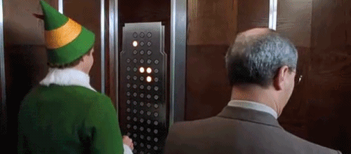

# Interactive-office-building-interface
Homework #1 for Human Computer Interaction CS3366

The standard design for elevator interfaces often disregards security and does not guide users to interact in an efficient manner.
We can see the problems that complete user control creates in the following gif. Additionally, in office buildings, users likely need to be limited to floors owned by their employer.

If a security RFID tag is used. A dynamic interface can be created that guides the user to options that are intended for them. Additionally, a digital interface provides the opportunity to integrate employer information and animations that limit choices outside of the user’s security group. An example of the improved interface, converted to a multiple elevator dispatch system, placed outside the physical elevator (common in corporate offices), is shown below.  

A user needs to know when and where to scan their card, observe a list of available floors, and select a desired floor within their security group.

The improved interface guides the user through each step. First, they are prompted with an arrow and a message to scan their id. Second an animation clearly displays the floors the user is allowed to choose from, with additional visuals confirming the employer. Third, easy to distinguish buttons are shown to allow floor selection. Finally, A message with a flashing arrow shows the user which to which direction and elevator bay they should proceed.

The outdated may allow the user to select any floor. This presents a security risk and is solved with the RFID tag. Even if the outdated model includes an RFID, all floors are presented to the user. An employer may have various floors in different parts of the building and a new employee may not know what floor to select. The improved interface groups the floor pertaining to the needs of the user and visually emphasizes them to aid selection. Additionally, selections are limited to one, to prevent selection abuse. After a valid selection has been made, the animations ensure that the user is informed on what elevator they should enter. By the time the user steps into an elevator, no further action is required.
